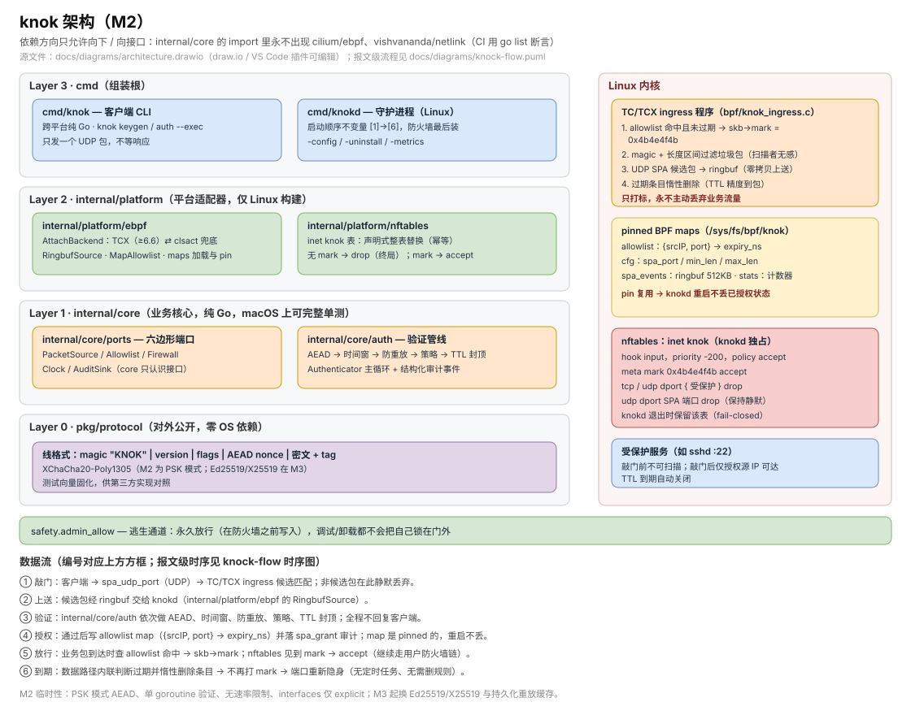
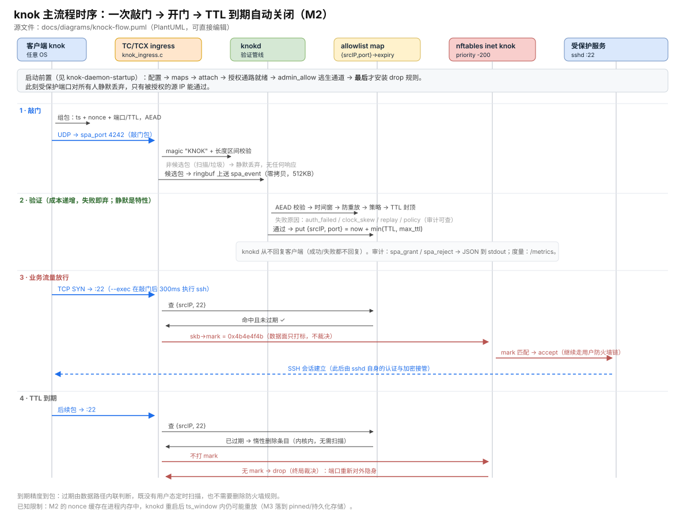

# knok

[English](README.md) | 中文

> Knock knock. 一个包，带签名，门就开了。

**knok** 是用 **eBPF + Go** 重写的单包授权（Single Packet Authorization, SPA）实现——把 [fwknop](https://github.com/mrash/fwknop) 按云原生时代的需求从零重做。

## 它解决什么问题

把 SSH（或任何管理端口）暴露在公网上的服务器，几分钟内就会被扫描和爆破；一旦这个服务出现 0-day，任何能连上它的人都能利用。常见对策都有代价：IP 白名单要求访问者地址固定；VPN 意味着一条常驻隧道、客户端软件和更大的信任面；反向隧道则需要一台中继。

knok 的做法是**让这个端口在网络层彻底不存在**：

- **敲门之前，受保护端口不存在。** 所有包被静默丢弃——不回 RST、不回 ICMP、没有 banner。扫描器拿不到任何可以利用的东西，因为扫不到。
- **一个 UDP 包即可开门，只对第一个源 IP，只开一段有限时间。** 客户端发送一个 AEAD 加密的包，内含时间戳、随机 nonce 和请求的端口；knok 在贴近内核的快路径上完成验证，把访问权授予该包的**源 IP**，时长取 `min(请求 TTL, 策略上限)`。
- **门会自己关上。** 过期判断在数据路径内逐包完成——不需要定时任务、不需要用户态扫描规则、不需要清理作业。

| | fwknop | knok（M2） |
|---|---|---|
| 开门动作 | `fork/exec iptables`（毫秒级） | 写 eBPF map（微秒级） |
| 抓包 | libpcap 轮询 | TC/TCX + ringbuf（事件驱动） |
| 密码学 | Rijndael-CBC / GnuPG（+HMAC） | XChaCha20-Poly1305（M2 为 PSK 模式；Ed25519/X25519 在 M3） |
| 审计 / 指标 | 无 | 结构化 JSON 审计 + `/metrics` |

## 工作原理



控制面（Go）负责验证敲门包并把授权状态写进 pinned eBPF map；数据面（TC/TCX）只做三件事——查这份状态、给已授权的包打 mark、过滤垃圾包。accept/drop 的最终裁决由 knok 独占的 nftables 表完成。这个分工正是 NAT、conntrack 和你现有日志都能继续工作的原因。图下方的编号 ①–⑥ 就是数据路径。

完整主流程（敲门 → 验证 → 业务流量放行 → TTL 到期）：



可编辑的图源文件：[`docs/diagrams/architecture.drawio`](docs/diagrams/architecture.drawio)（draw.io / VS Code 插件可编辑）、[`docs/diagrams/knock-flow.puml`](docs/diagrams/knock-flow.puml)、[`docs/diagrams/daemon-startup.puml`](docs/diagrams/daemon-startup.puml)（PlantUML）。

## 跑起来（5 步）

需要 Linux ≥ 5.8（内核 ≥ 6.6 会自动选 TCX）、root 权限、`nft`，以及挂载在 `/sys/fs/bpf` 的 bpffs。

```sh
# 1. 编译两个二进制
go build -o knokd ./cmd/knokd
go build -o knok  ./cmd/knok

# 2. 生成预共享密钥（M2 开发模式），两端必须一致
./knok keygen --psk
#   → hex:1f3c...   （把这个值复制下来）

# 3. 写服务端配置
sudo mkdir -p /etc/knok
sudo tee /etc/knok/knokd.toml >/dev/null <<'EOF'
[keys]
psk = "hex:1f3c..."            # 粘贴第 2 步的输出

[listen]
spa_udp_port = 4242            # 敲门包到达的端口
protected_ports = [22]         # 要隐藏的端口

[policy]
allowed_ports = [22]           # 必须覆盖所有受保护端口
max_ttl = "30m"
ts_window = "300s"

[safety]
admin_allow = ["203.0.113.7/32"]   # 你自己的管理地址：永久放行，无需敲门

[interfaces]
mode = "explicit"
explicit = ["eth0"]            # M2 只支持 explicit 模式

[pin]
dir = "/sys/fs/bpf/knok"
EOF

# 4. 启动守护进程（防火墙是**最后**一步才装：授权通路必须先就绪，
#    顺序说明见 docs/diagrams/daemon-startup.puml）
sudo ./knokd -config /etc/knok/knokd.toml

# 5. 客户端：敲门，然后连接
./knok auth --server <服务器IP> --spa-port 4242 --ports 22 --ttl 60s \
    --psk "hex:1f3c..." --exec "ssh user@<服务器IP>"
```

验证与清理：

```sh
sudo nft list table inet knok            # knok 安装的 drop 规则
curl -s 127.0.0.1:9601/metrics           # eBPF 计数器 + Go 侧 ringbuf 计数器
sudo make e2e                            # 对真实内核跑完整验收
sudo ./knokd -uninstall -config /etc/knok/knokd.toml   # 拆表、摘附着、删 pin
```

## 怎么改配置

配置文件是**唯一**的配置来源（命令行只有 `-config`、`-uninstall`、`-metrics` 三个开关）。

| 字段 | 含义 | 说明 / 默认值 |
|---|---|---|
| `keys.psk` | 预共享密钥，`hex:<64 位十六进制>` | 必须与客户端的 `--psk` 一致；由 `knok keygen --psk` 打印 |
| `listen.spa_udp_port` | 接收敲门包的 UDP 端口 | 默认 `4242`；该端口在 nftables 里同样 drop，以保持静默 |
| `listen.protected_ports` | 要隐藏的端口，如 `[22, 2222]` | 会渲染成 `tcp` **和** `udp` 两条 drop 规则 |
| `policy.allowed_ports` | 敲门包允许请求的端口集合 | **必须覆盖所有受保护端口**，否则那个端口永远不可达；不满足时 knokd 会告警 |
| `policy.max_ttl` | 单次授权时长上限 | 默认 `30m`；必须 > 0 |
| `policy.ts_window` | 敲门包时间戳容忍窗口 | 默认 `300s`；同时也是防重放缓存的存活期；必须 > 0 |
| `safety.admin_allow` | 永久放行（逃生通道），无需敲门 | 只接受单地址（`/32`、`/128`）；建议**首次启动前**就填好 |
| `interfaces.mode` / `interfaces.explicit` | 要 attach 的网卡 | M2 仅支持 `explicit`，且至少要写一个网卡名 |
| `pin.dir` | map/link 的 pin 目录 | 默认 `/sys/fs/bpf/knok`；必须是至少两级的绝对路径（写错会被拒绝，而不是被删除） |

改完怎么生效：

1. 编辑 `/etc/knok/knokd.toml`；
2. 重启守护进程（`Ctrl-C`，再 `sudo ./knokd -config ...`）。**M2 没有热重载**——`SIGHUP` 热重载在 M5。退出时守护进程刻意保留 eBPF 附着与 nftables 表（fail-closed：已授权流量与"默认 drop"的裁决在崩溃后依然成立）；
3. nftables 表在启动时整表替换，所以把一个端口从 `protected_ports` 里删掉，它就会真的恢复可见；未过期的授权因为 map 是 pinned 的，能跨重启存活；
4. 想彻底清除：`sudo ./knokd -uninstall -config /etc/knok/knokd.toml`。

两条避免把自己关在门外的规矩：留着 `safety.admin_allow`（或云控制台）作为后路；**不要在自己的防火墙里为受保护端口写 accept 规则**——契约是"无 mark → drop，有 mark → accept"，第二条 accept 会让同一个包有两套互相冲突的含义。

### knok 独占的 `inet knok` 表

- `inet knok` 表归 knok 所有，启动时整表替换；不要往里加你自己的规则。
- 它挂在 `input` 钩子、**优先级 -200**（在你的 `filter` 链之前），并保持 `policy accept`——通过之后的流量仍然受你自己的规则约束。
- mark **`0x4b4e4f4b`**（ASCII "KNOK"）是保留值：不要用它标记你自己的包。
- 目前**没有自动冲突检测**——knokd 不检查你的链，只对自己配置里的问题告警。

## 已知限制（M2）

- **防重放缓存在进程内存里。** 被截获的敲门包，在 knokd 重启后只要仍在 `ts_window` 内就可以重放；由于授权绑定的是包的**源 IP**，重放者的地址会拿到这次授权。M3 会把缓存落到 pinned/持久化存储。
- **只有 PSK 模式**——还没有 Ed25519 签名与 X25519 密钥协商。
- **没有限速**（`StRateDrop` 是预留槽位，M6）；验证只有**一个** goroutine；`interfaces.mode` 仅支持 `explicit`（M5）。
- **SPA 传输仅支持 UDP**；一次授权是协议无关的（TCP 与 UDP 同时开放）。
- **尚未达到生产可用标准。** 目标设计见 spec：[`docs/superpowers/specs/2026-09-26-knok-mvp-design.md`](docs/superpowers/specs/2026-09-26-knok-mvp-design.md)。

## 状态

🚧 **早期开发中——已达 M2 里程碑。** 端到端流程在 Linux 上可用（TCX/TC + nftables）：一次敲门为受保护端口开一个有界 TTL，授权能跨守护进程重启存活，`scripts/e2e.sh`（`sudo make e2e`）会对着真实内核逐条验证这些行为。

```
cmd/knok/       客户端 CLI（跨平台，纯 Go）
cmd/knokd/      服务端守护进程（Linux，cilium/ebpf）
pkg/protocol/   包格式、AEAD、签名（可执行的协议规范）
internal/core/  验证管线与接口（无平台依赖）
internal/platform/  eBPF、nftables、mark（Linux 适配器）
bpf/            eBPF 源码（bpf2go）
```

## 授权

GPL-2.0 —— 与 fwknop 同谱系。见 [LICENSE](LICENSE)。